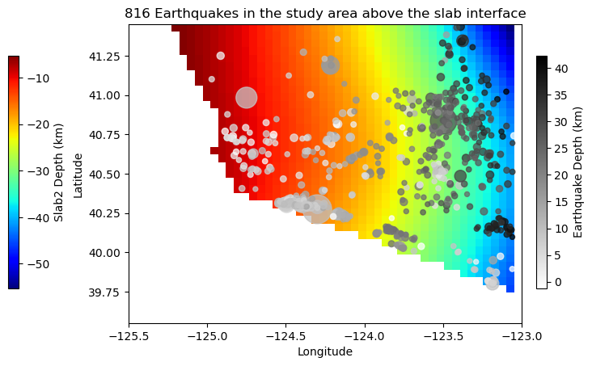

This final project sub-repository contains the codes and data for my final project.
* Whole project is divided into several tasks:
* Part 1: Selection of earthquakes that follow some conditions using pandas
    (see code/Part_1_UpperPlateEQs.ipynb) \
        * Occured between 2008 and 2022 (inclusive)
        * Above the plate interface (plate interface depths will be interpolated from another data file) \
        * Divide the whole study area into 0.5x0.5 grids and select earthquakes in each grid. One (or few) events from each grid will be used for regional stress study.
        
* Part 2: Downloading earthquake `mseed` (miniseed) files using `Obspy` package.
    (see code/Part_2_getEQ_from_inv_V5.ipynb) \
        * First I will get the inventory file for a event (which networks, stations, channels recorded the data). \
        * A for loop will go through each Datacenter, each network, each station and so on. \
            * This code will avoid download duplicates as different datacenters have common seismic stations. \
        * I will define a function using python `multiprocessing` library to parallelize the process and divide stations to download among multiple processing units to sped up the whole process.

Final publication quality (Figure 3 in part_1 notebook)

 \
Figure: This figure shows earthquake locations (black dots) that are located (in terms of depth) above the interface between two converging plates. Red-blue color grading clearly shows the depth of the interface increasing to the west. Earthquake magnitude is indicated by the size of the dots and depth by darkness of the dots. Note that the dots are exaggerated to make them more visible.

<!-- Please ignore the following as I was not able to go that far I will do these step for my own research
        * Part 3: `(not included here)` Picking earthquake arrival times at each station using `PyRocko` package which is a UI based software and the `mseed` files from `Part 2`. This will produce a `txt` file containing earthquake arrival times, P-wave polarity (positve/negative), station location for each event ID. This is a manual process.
        * Part 4: Earthquake location determination using `grid search` method and checking location accuracy of depth given by USGS. This uses a lot of computing power as the whole study area will be divided into 3D cubes and calculate seismic raypath from source to station. I will try to use `parallel computing` in this step.
        * Part 5: Determine `Focal mechanism` of each major earthquake using `HASH` software (a fortran program widely used for this purpose). Focal mechanism is displayed as a `beachball` which shows areas of compressional and dialational stress around an earthquake.
        * Part 6: Use machine learning algorithms to determine `Focal mechanism` and compare them with calculated results from the `HASH` program. -->